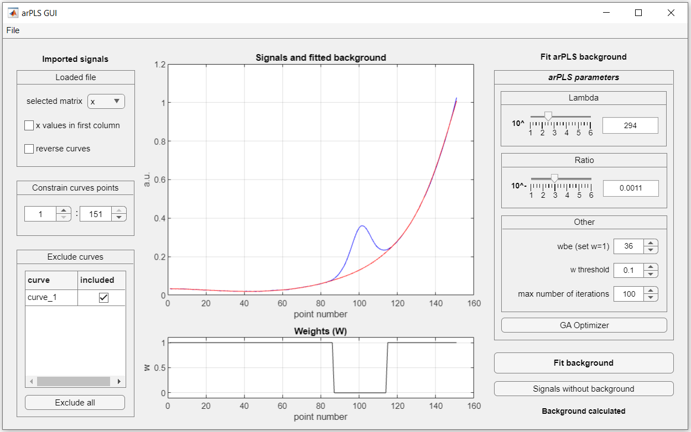
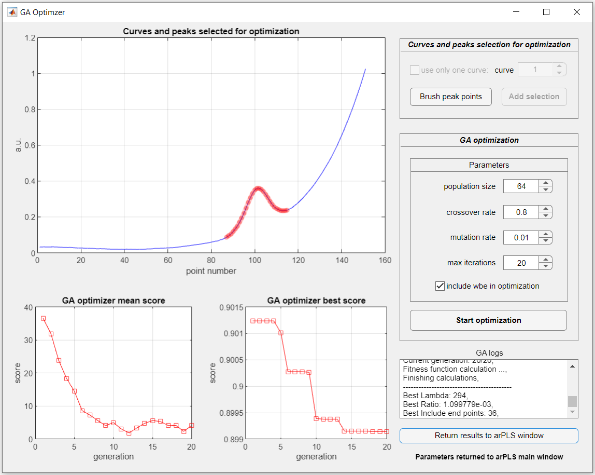

# A graphical user interface (GUI) for arPLS baseline correction

The arPLS GUI was developed to facilitate baseline correction. It incorporates asymmetrically reweighted Penalized Least Squares (arPLS) method, with Graphical User Interface (GUI) implemented in Mathworks Matlab. The arPLS is a proven method for background correction, even for signals with complicated baseline, including many peaks and noise. The GUI was designed to provide a signal with an approximated baseline in a few clicks, ready to save or export to the Matlab workspace. It includes Genetic Algorithm Optimizer to adjust parameters of the arPLS method.

## Requirements

The arPLS GUI is fully compatible with Matlab 2020a and newer. The GA Optimizer requires brash plot functionality, which was implemented with uifigure since Matlab 2020a. However, there is the possibility to use the arPLS main window alone, without the GA Optimizer. It is compatible with Matlab 2018a and newer.

## arPLS main window

The application starts after running the _arPLS_gui_ file. To start the application regardless of the current path in Matlab, use the _Set Path_ option from _Home > Environment > Set Path_ and add path to _arPLS_gui_ file. The interface of the arPLS main window can be divided into 3 columns. The left contains options to import and prepare signals to arPLS. The middle displays selected signals, with fitted background with weights. The right adjusts the arPLS parameters and starts the background calculation. The top left menu _File_ loads data from the file and exports results of arPLS baseline correction.

### Loading and selecting data

Signals can be loaded only from files. To import data from the file, select _Load file_ from the _File_ menu. GUI accepts only two types of files: mat and txt. After loading a file, it is necessary to select a matrix, because the mat file may contain many Matlab matrices, but the GUI may operate only on a single matrix (_double_ type). When loading a txt file, the GUI creates one matrix and assigns to it the entire contents of the txt file. Such a matrix may contain single or multiple curves (signals). Curves must be in columns, to be properly loaded and displayed. The GUI also provides two options to _Constrain curves points_ and _Exclude curves_ from further baseline approximation. First of those options, allow to cut off few beginning and ending points of signals. The second helps to exclude unwanted curves from the baseline approximation. It is done by unchecking the checkbox next to the unwanted curve.

### Calculating arPLS baseline

Before the calculation of the baseline, it is recommended to adjust the arPLS parameters. It can be done manually or automatically using the implemented GA Optimizer.
The most important parameter that affects arPLS is lambda (_λ_), which adjusts the smoothness of the baseline. Its value can be set between 10e1 and 10e6. The higher the value of _λ_, the greater the smoothness and straightness of the approximated baseline. Another parameter optimized for arPLS is the ratio (_r_). It value can be set between 10e-1 and 10e-6. It directly determines how fast arPLS algorithm convergence is. The GUI provides also the _wbe_ parameter, which force arPLS algorithm to assign weights for beginning and ending points of signal to 1, and arPLS cannot change itself. That helps to better approximate the beginning and ending points of signals with the arPLS baseline.
Other less important option is the _w threshold_, which determines how the arPLS algorithm calculates the weights w. Basically, it changes the weight assignment in the 0-1 interval to a binary assignment only between 0 or 1 values. Another parameter is the _maximum number of iterations_, which should not be described.
After the calculations are completed, the GUI presents the results by displaying the signals with an approximated baseline in the main plot and weights at the bottom plot.

### Exporting baseline

In menu File, the GUI provides two options to export results of the baseline approximation: _Export fit to .mat file_ or _Export fit to workspace_. In both options, exported data contains four matrices: selected signals for whom the baseline was approximated (including constraints and curves exclusions), approximated baseline (or baselines), weights from final iteration and signals with subtracted baseline.

## GA Optimizer window

The arPLS method requires at least two parameters (_λ_ and _r_) to generate a proper baseline. Therefore, an automatic optimization was provided using a genetic algorithm (GA) to facilitate this tusk. Access to GA Optimizer is from the arPLS GUI main window, after loading and selecting signals, by clicking the GA Optimizer button. The optimizer interface contains two key features: first, the options to graphical selection curve and peaks for optimization, and second, the options to adjust, start and observe results of the optimization. Curves and peaks selection is done with the option in the top-right panel, which also enables brushing points in the main plot of the Optimizer. Options of GA can be adjusted by its parameters panel (in the middle right). The optimization results are presented on the _GA optimizer mean_ and _best score_ plot supplemented with text messages from the _GA logs_.

### Curves and peaks selection for optimization

GA optimization is usually calculationally demanding, especially when the number of curves is significant. Thus, anyone may decide to choose between: longer more precise optimization including all curves or faster, less precise optimization with only one curve. In order to limit curves to one, it is necessary to check _use only one curve_ option. This option is not enabled by default, and all curves are included.
Furthermore, the GA Optimizer requires information about the localization of the peaks, not just the peaks maximum, but the localization of the whole peaks. Such information must be provided by the researcher, but in our GUI it is done using a convenient, graphical interface by brushing peak points in the plot. Selection starts by the _Brush peak points_ button. The mouse cursor should change into a cross when hovering over the plot with the curves. Then, peaks selection is done by just drawing rectangle selection by cursor. Multiple peaks selection is possible with the _Shift_ key, and deselection is by selection of already selected points. To deselect all peak just select any free space in the plot. The approval of the peaks selection is done by pressing the _Add selection button_. Since then, optimization is enabled.

### Performing GA optimization

After curve and peaks selection, it is possible to start GA optimization of arPLS parameters. GA has its own parameters which can be adjusted too, but in almost all cases leaving default values should be optimal. It is also recommended to leave the option to include _wbe_ in optimization checked. In most cases, optimizing the _wbe_ parameter with _λ_ and _r_ provides a better arPLS baseline.
Tracking optimization progress is possible by observing plots and logs. The plot updates with information on the current state of the population (_GA mean score plot_) and the best score of the fitness function (_GA best score plot_). The values of both should gradually decrease. At first, the _GA mean score value_ is usually high, meaning that the population contains many different solutions, mostly suboptimal. With successive generations, the population becomes more uniform, containing only the best solutions, what is expected. The second plot, the _GA best score_, shows the lowest score for the best chromosome in the population. It also gradually declines with the generation of algorithms. When the GA Optimizer convergences, the best combination of _λ_, _r_, _wbe_ is displayed at the bottom of the _GA logs_. Pressing the _Return results to arPLS window_ button, the best parameters are transferred to the arPLS main window, and the baseline calculation is performed.

## License

arPLS GUI is licensed under GPLv3.

## Authors

This program is developed by Łukasz Górski <lgorski@agh.edu.pl> and Małgorzata Jakubowska <jakubows@agh.edu.pl>.
